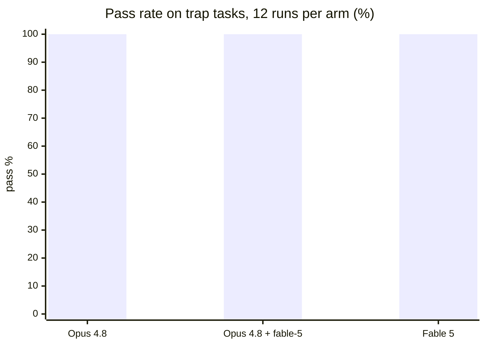
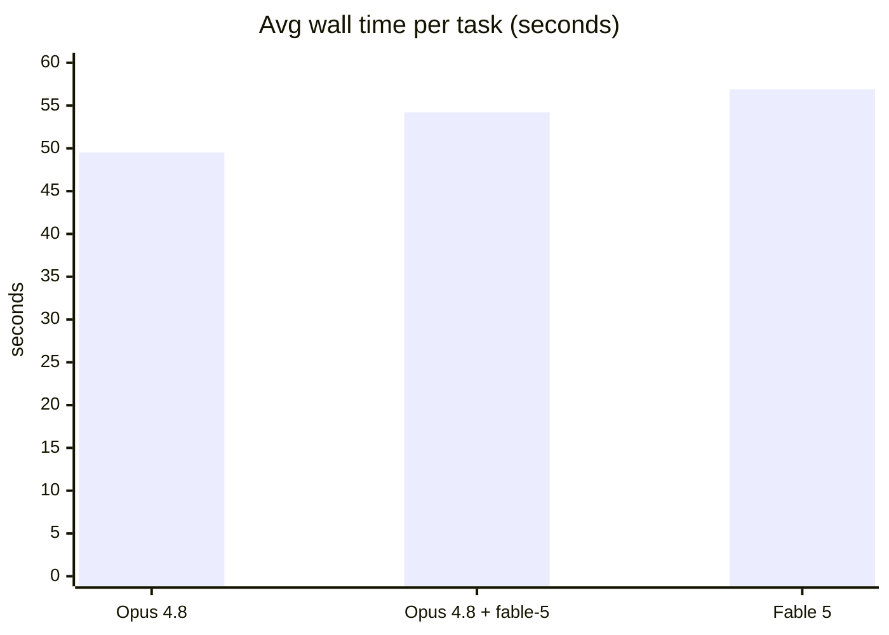

# fable-5

Fable 5's working loop for hard, multi-step tasks, packaged as a Claude Code plugin.

Built by [LearNer](https://github.com/Learn57130).

**Core loop:** decompose along verification boundaries → attack the load-bearing unknown first → verify with the smallest check that would fail if you're wrong → pick the next action by what would change the plan.

## Contents

- `skills/fable-5/` — the skill: 8-step loop, verification catalog (smallest failing check per task type), decomposition patterns, `preflight.sh` pre-completion sweep.
- `skills/fable-5/agents/` — `fable-scout` (read-only comprehension pass) and `fable-refuter` (adversarial verifier, defaults to REFUTED when uncertain). Registered automatically on plugin install; also usable as plain prompt templates in other harnesses.

## Install

**Claude Code** (skill + agents auto-registered):
```bash
claude plugin marketplace add https://github.com/Learn57130/fable-5
claude plugin install fable-5@fable-5
```

**Codex / Cursor / Kimi** — the repo ships `.codex-plugin/`, `.cursor-plugin/`, `.kimi-plugin/` manifests pointing at `skills/`; install via each tool's plugin mechanism, or just symlink:
```bash
git clone https://github.com/Learn57130/fable-5
ln -s "$(pwd)/fable-5/skills/fable-5" ~/.codex/skills/fable-5
```

**Gemini CLI** — install as an extension (`gemini extensions install https://github.com/Learn57130/fable-5`); `gemini-extension.json` loads `AGENTS.md` (the compact loop) as always-on context. Or drop `skills/fable-5` into `~/.agents/skills/`, which Gemini auto-scans.

**Antigravity** — no plugin format; clone and symlink the skill:
```bash
ln -s "$(pwd)/fable-5/skills/fable-5" ~/.gemini/antigravity/skills/fable-5
```

Note: if you already expose `skills/fable-5` as a personal skill (e.g. via `~/.claude/skills`), installing the plugin duplicates it in Claude Code — use one or the other per machine.

## Benchmark

Three arms — Opus 4.8 vanilla, Opus 4.8 + fable-5 loop as system prompt, Fable 5 vanilla — graded by held-out deterministic checks with symptom-fix traps ([protocol](benchmarks/README.md)). Arms are isolated from user-level hooks (`disableAllHooks`). Run 2026-07-07, tasks 04–07 × 3 reps per arm.





| Arm | Easy set (01–03, 9 runs) | Trap set (04–07, 12 runs) | Avg time (traps) |
|---|---|---|---|
| Opus 4.8 (vanilla) | 9/9 | 12/12 | 49.5s |
| Opus 4.8 + fable-5 | 9/9 | 12/12 | 54.2s |
| Fable 5 (vanilla) | 9/9 | 12/12 | 56.9s |

**Honest read.** The trap tasks were built so that fixing only the reported symptom fails (two-hop root causes, sibling-caller contracts, hidden docstring requirements, held-out spec edges) — and every arm still passed everything, with clean (hook-free) contexts. Conclusions this data supports:

- **Opus 4.8 + fable-5 ≈ Fable 5** on these tasks: indistinguishable (both 12/12).
- **Opus 4.8 + fable-5 > Opus 4.8 is NOT shown**: vanilla Opus 4.8 also went 12/12 — at this task scale it already root-causes and reads contracts without help.
- The loop costs ~5s/task of extra deliberation and causes no regressions.

Where the loop plausibly pays off is what a cheap headless benchmark can't capture: long multi-step sessions, large codebases, ambiguous scope — places where drift and premature "done" happen. Separating 4.8-class models needs long-horizon tasks with much higher per-run cost. Task contributions welcome: `files/` + `prompt.md` + held-out `check.sh`.
