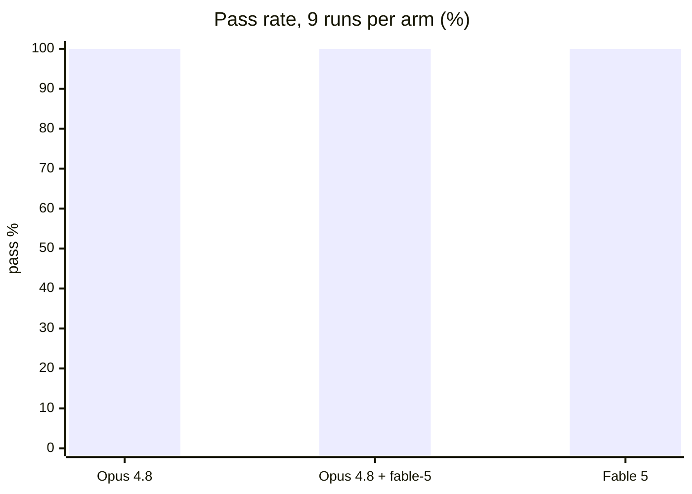
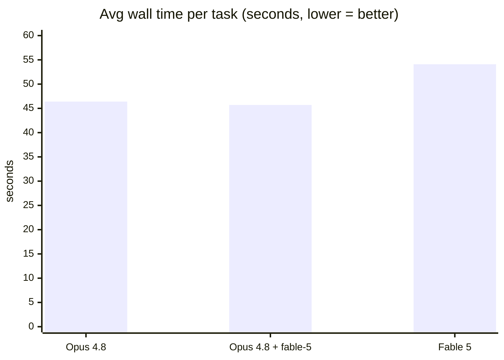

# fable-5

Fable 5's working loop for hard, multi-step tasks, packaged as a Claude Code plugin.

Built by [LearNer](https://github.com/Learn57130).

**Core loop:** decompose along verification boundaries → attack the load-bearing unknown first → verify with the smallest check that would fail if you're wrong → pick the next action by what would change the plan.

## Contents

- `skills/fable-5/` — the skill: 8-step loop, verification catalog (smallest failing check per task type), decomposition patterns, `preflight.sh` pre-completion sweep.
- `skills/fable-5/agents/` — `fable-scout` (read-only comprehension pass) and `fable-refuter` (adversarial verifier, defaults to REFUTED when uncertain). Registered automatically on plugin install; also usable as plain prompt templates in other harnesses.

## Install

**Claude Code** (skill + agents auto-registered):
```bash
claude plugin marketplace add https://github.com/Learn57130/fable-5
claude plugin install fable-5@fable-5
```

**Codex / Cursor / Kimi** — the repo ships `.codex-plugin/`, `.cursor-plugin/`, `.kimi-plugin/` manifests pointing at `skills/`; install via each tool's plugin mechanism, or just symlink:
```bash
git clone https://github.com/Learn57130/fable-5
ln -s "$(pwd)/fable-5/skills/fable-5" ~/.codex/skills/fable-5
```

**Gemini CLI** — install as an extension (`gemini extensions install https://github.com/Learn57130/fable-5`); `gemini-extension.json` loads `AGENTS.md` (the compact loop) as always-on context. Or drop `skills/fable-5` into `~/.agents/skills/`, which Gemini auto-scans.

**Antigravity** — no plugin format; clone and symlink the skill:
```bash
ln -s "$(pwd)/fable-5/skills/fable-5" ~/.gemini/antigravity/skills/fable-5
```

Note: if you already expose `skills/fable-5` as a personal skill (e.g. via `~/.claude/skills`), installing the plugin duplicates it in Claude Code — use one or the other per machine.

## Benchmark

Three arms — Opus 4.8 vanilla, Opus 4.8 + fable-5 loop as system prompt, Fable 5 vanilla — on 3 tasks × 3 reps, graded by held-out deterministic checks ([protocol](benchmarks/README.md)). Run 2026-07-07 via `benchmarks/run.sh 3`.





| Arm | Pass rate | Avg wall time |
|---|---|---|
| Opus 4.8 (vanilla) | 9/9 | 46.4s |
| Opus 4.8 + fable-5 | 9/9 | 45.7s |
| Fable 5 (vanilla) | 9/9 | 54.1s |

**Honest read:** ceiling effect — all arms passed every task, including the sibling-caller and hidden-edge traps, so this task set is too easy to separate 4.8-class models. What it does establish: the fable-5 loop costs nothing (no slowdown, no regressions) while guaranteeing the discipline on tasks where models are less consistent. Discriminating results need harder tasks (multi-file refactors, ambiguous specs) — contributions welcome, same layout: `files/` + `prompt.md` + held-out `check.sh`.
